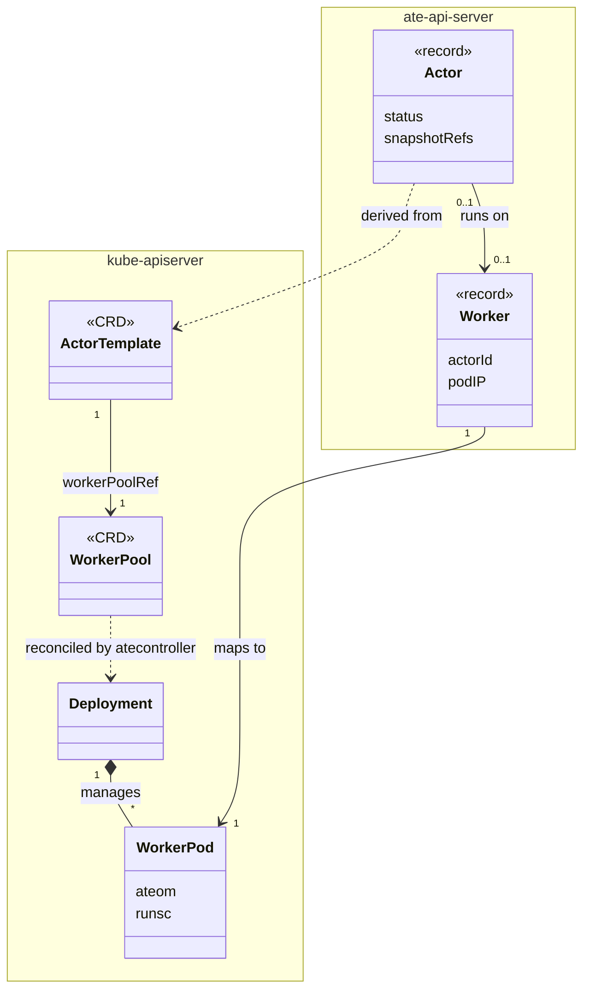
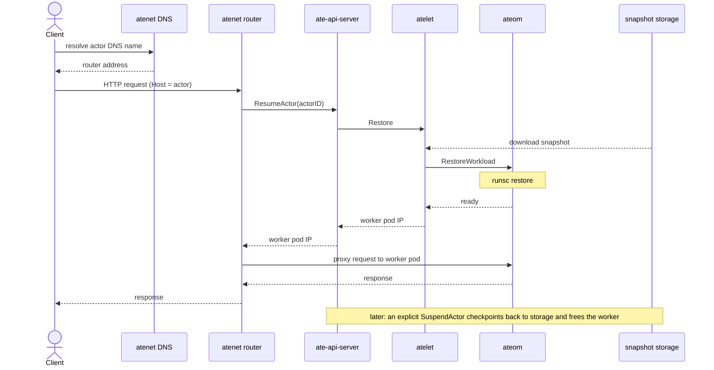
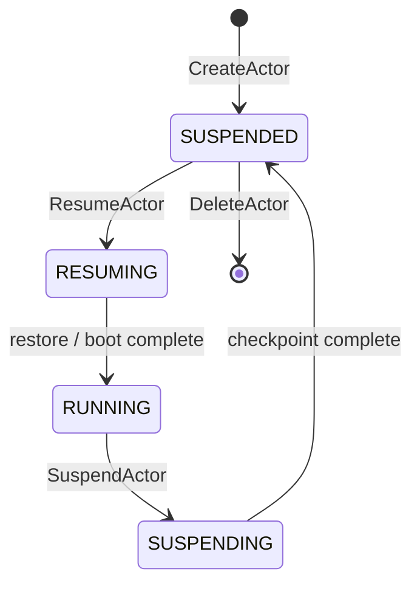

# Agent Substrate Architecture

NOTE: Much of this architecture is aspirational, and is not yet implemented!

## Overview

Agent Substrate is a system built on top of Kubernetes which manages agent-like
workloads to achieve high workload density and scale.  It builds on top of
Kubernetes, but takes the Kubernetes control-plane out of the critical path to
achieve lower latency. Kubernetes provides the infrastructure provisioning and
management, while Agent Substrate provides agent-specific scheduling and
control.

## Problem Statement

Kubernetes is the industry standard platform for running modern workloads.  It
is built to support a wide array of workloads, and it can scale to very large
clusters.  Kubernetes is designed to handle tens- or hundreds-of-thousands of
relatively long-running workloads, but running agents at scale presents new
challenges.

Agents and "agent-like" workloads are generally very bursty, spending most of
their time waiting for input or events, then handling those events, then going
back to waiting.  The time they spend actually doing work is often very short,
and the time they spend waiting can be unbounded.  Because they often run
untrusted logic, they are often run in sandboxes, which means they are usually
single-tenant instances, and there are a great many of them.

Running these on Kubernetes presents a number of challenges:
  * Idle Pods still consume resources.  While Kubernetes is very scalable,
    compute capacity is finite and has real costs.  Whether we're talking about
    CPU time, memory space, or just the number of Pods per node, agent-like
    workloads are terrible for efficiency.
  * The Kubernetes API server is not designed to handle millions of resources.
    It excels at reconciling resources asynchronously across many controllers,
    but it is not so good at storing very large numbers of discrete resources,
    or for handling a huge volume of write traffic.
  * Scheduling a workload on Kubernetes requires several asynchronous processes
    to converge, plus several network hops, plus image pulling and other steps,
    which can add up.  Getting a Pod running in a couple of seconds is great
    when that Pod will run for hours or days, but for a workload that will run
    for milliseconds to low-digit seconds, that latency is unacceptable.
  * State management is difficult.  Kubernetes provides an API for managing
    state (PersistentVolumes), but it is not designed for millions of volumes,
    with widely varying amounts of data, being attached and detached at high
    speed.

## Core Concepts and Approaches

Standard Kubernetes Pods are simply too heavy for many agentic workloads.

### Terminology: "Actor"

Agent Substrate seeks to solve these problems for "agent-like" workloads.
Often we simply say "agents", but it's important clarify that "agent-like"
workloads are not necessarily literally AI agents.  In most of the docs we
instead use the term "actor" to refer to an instance of an agent-like workload.

### Decoupling the Actor Lifecycle from Pods

The obvious way to solve the problem of many idle Pods consuming resources is
to not have idle Pods - we need to get rid of them when they are idle, and
bring them back when they are needed.  Suspend and resume is not a concept in
Kubernetes (yet!), but even if it was, the obvious way to implement it would
still run through the Kubernetes API server and scheduling subsystem, which is
(for now) too slow for our needs.

Since many agents run untrusted code, we need to run them in sandboxes of some
sort.  There are a number of sandboxing technologies available, notably
[gVisor](http://gvisor.dev) and micro-VMs such as
[Kata Containers](https://katacontainers.io/) are both popular options.  Both
of those happen to support some notion of suspend and resume.

Agent Substrate starts with suspend and resume.  When an actor is idle, we
suspend it, which frees up the resources it was consuming.  When an event comes
in that needs to be handled, we resume the actor.  To avoid the latency of
going through the Kubernetes scheduler, we pre-start long-running "worker"
Pods, which are just sandboxes waiting for work.  When an event comes in, we
assign it to a worker, which resumes the actor in that worker.  We can now
multiplex a larger number of actors onto a smaller number of workers, which
allows us to achieve higher density and efficiency, while also reducing
latency.

### A Focused Control Plane

That doesn't solve the problem of the Kubernetes API server not being ready to
handle millions of resources.  Unfortunately, there is no magic solution to
that.  Instead of storing every actor, whether active or idle, as a Kubernetes
object, Agent Substrate includes a small, focused control-plane component which
is focused on high scale and QPS.  It does not need the generality of the
Kubernetes API, which should allow it to be more effective for this use-case.

### Agent-Aware Routing

In order to achieve on-demand resuming of actors, we need to be able to trap and
inspect network traffic.  Agent Substrate includes a lightweight,
substrate-aware network proxy which can inspect incoming traffic and trigger
the resumption of actors as needed.

### New Problems

Of course, there's no such thing as a free lunch, and these approaches have
trade-offs.

First, we trade one problem (many idle Pods consuming resources) for another.
Doing suspend and resume at this scale introduces a vast data management
problem.  We need to store the state of millions of actors, which can update
many times per second.  Agent Substrate will need to consider data locality as
a first-class concern.  When an event comes in, we need to know where the
actor's most recent state is stored, and either route the event to that
location or move the state to where the event can be serviced.

In addition to that, we must acknowledge that building a new production-grade
control-plane component is a non-trivial effort.  It will need to be highly
available, secure, and performant, and it will need to integrate well with
Kubernetes.

Another problem to consider is observability and debugging.  With actors being
multiplexed onto and off of workers all the time, it will be more difficult to
understand what is happening. Agent Substrate will need to provide robust
tooling for monitoring and debugging actors, including the ability to thread
together metrics and logs for an actor over time, to inspect the state of
suspended actors, and to trace the events that lead to their current state.

### Problems We Haven't Addressed Yet

As early as this project is, there are several problems that we haven't even
started to tackle yet, but which we know will need to be solved eventually.

  * Autoscaling: We will need to be able to automatically scale the number of workers up
    and down based on demand.  Kubernetes Pod autoscaling may be sufficient or
    it might not.
  * Peer to peer state sharing: Relying on data locality presents a risk of
    data loss.  We probably need some form of state-sharing to protect against
    that, which needs to be balanced with saving state to a "permanent" store.
  * Control plane authn/z: We will need to ensure that the control plane is secure, and that only
    authorized users and agents can interact with it.
  * Identity and policy: We know that agents' needs for identity are very
    different than traditional workload identity and end-user credentials.
  * There are certainly more that we haven't thought of yet!

## North Star Metrics

Agent Substrate is an ambitious effort.  To keep us focused on the right
problems, we have identified a few north star metrics and targets.

  * Activation Latency: The time from when a wakeup event is received to when
    the agent can receive traffic.
    - Target: 100ms at 95th percentile
  * Scale: The total number of agents, active and idle, that can be supported
    in a single cluster.
    - Target: 1 billion
  * Throughput: The number of wakeup events that can be handled per second in
    a single cluster.
    - Target: 1000/second

## Personas

There are a few different personas that interact with the system:

  1) **Cluster admins**: These are the people who own the Kubernetes cluster and
     are responsible for its overall health and performance.  If the Agent
     Substrate needs more capacity, these are the folks who manage things like
     cluster autoscaling, node provisioning, and so on.  They probably don't
     need to interact directly with the Agent Substrate much, if ever.

  2) **Substrate admins**: These are the people who set up and own the Agent
     Substrate instance(s) in a Kubernetes cluster.  They are obviously aware
     that it is running in a Kubernetes cluster, and are responsible for
     configuring the Kubernetes resources for it (such as WarmPools).

  3) **Agent developers**: These are the people who deploy agents into a substrate
     for users or higher-level systems to consume. They might have to be aware
     that they are using Kubernetes (some concepts are represented as CRDs,
     such as ActorTemplates), or they might be using a higher level API which
     itself uses Agent Substrate under the hood.

  4) **Agent users**: These are the people who interact with agents running in the
     substrate.  They might be end-users of an application that is built on top
     of Agent Substrate, or they might be higher-level systems that are using
     Agent Substrate as a building block. They should not need to be aware that
     they are using Kubernetes at all.

## High-Level Design

A substrate admin deploys the Agent Substrate into a Kubernetes cluster.  They
configure the WorkerPool(s) that will be used to execute actors and prepare the
substrate's control-plane for use.  Worker Pods are started, waiting for
assignments.

An agent developer defines an ActorTemplate (a CR) which describes what it
means to instantiate that actor - what OCI image to run, how much memory it
needs, behavioral parameters, etc.  The Agent Substrate uses that ActorTemplate
to create a "golden snapshot" of the actor, which will be used to fast-start
instances of that actor in the future.

An agent user (or a higher-level system) makes a request to instantiate an
actor.  They specify which ActorTemplate to use and other parameters.  The
Agent Substrate creates an Actor record in its control-plane storage, which
tracks the state of that actor (suspended or running).

When a request comes in for that actor instance, the Agent Substrate's proxy
intercepts the request.  It looks in the control-plane to determine if that
actor is currently running or not.  If not, it assigns the actor to a worker,
which involves telling a node-level component (the "atelet") to restore the
actor's most-recent snapshot into the worker on that node.  The request is then
forwarded to the actor.

Eventually, the user (or the higher-level system) is done with the actor, or it
has been idle for a while.  It can request the Agent Substrate to suspend the
actor, taking a snapshot and freeing up the worker.  The next time a request
comes in for that actor, it will be resumed again, possibly on a different
worker.

## API Resource Models

Agent Substrate categorizes resources into two groups based on their
persistence requirements and the frequency of state transitions.

### System Configuration (Declarative/CRD-based)

These resources define the intended state of the system and are managed via
Kubernetes CRD APIs. They are used for administrative operations and actor
environment definitions.

  * **WorkerPool**: Defines a pool of "warm" compute capacity. It manages a
    fleet of standby worker pods initialized and ready to receive resumed actor
    states. Optional `spec.template` fields configure worker pod node
    selection, tolerations, priority class, and node affinity.

  * **ActorTemplate**: An immutable definition of an actor-version. It
    encapsulates the container image, configuration, and environment required
    to generate a "golden" snapshot.

### Dynamic Instance State (Database-based)

These resources represent the high-frequency, ephemeral state of individual
actors and workers. They are stored in a high-performance, low-latency state
store (currently ValKey/Redis) to support real-time operations.

  * **Actor**: A specific instance of an ActorTemplate. An Actor record tracks
    its globally unique identifier, physical location (Worker IP), current
    status (RUNNING or SUSPENDED), and version-specific state metadata.

  * **Worker**: A representation of a worker pod in the WorkerPool. It tracks
    the worker's unique identifier, current status (IDLE or BUSY), and the
    Actor it is currently hosting (if any).

### Architectural Rationale

Agent Substrate utilizes this dual-layer model to optimize for both Reliability
and Performance:

  1.  **Scalability**: Offloading the high-frequency, high-scale management of
      millions of actors to a specialized state store prevents overwhelming the
      primary cluster control plane with thousands of updates per second.

  2.  **Latency**: Achieving 100ms resumption requires low-latency state
      lookups and atomic worker assignments that bypass the eventual
      consistency and variable latency of standard Kubernetes API servers.

  3.  **Governance**: Using Kubernetes objects for the environment (WorkerPools
      and Templates) allows platform teams to apply familiar RBAC, auditing,
      and policy enforcement to the underlying infrastructure.

### Resource Model

The CRDs and control-plane records described above, with their relationships and
multiplicities (UML class diagram):

## System Components

### Control Plane (`ate-api-server`)

The brain of the system. It exposes a gRPC API for the data plane and CLI to
manage actor lifecycles.

  * **State Store**: Tracks the mapping of Actors to Workers in a
    high-performance Redis store.

  * **Scheduler**: Selects a ready worker for a resumption request.

  * **Workflow Engine**: Orchestrates the multi-step Resume/Suspend sequences
    (lock acquisition, storage download, sandbox restore).

### Node Supervisor (`atelet` + `ateom`)

The node-level subsystem manages the physical execution of sandboxes and the movement of snapshots.

  * **atelet**: A lightweight supervisor running on each node as a DaemonSet. It acts as the "Herder," managing a pool of physical pods and communicating with the Control Plane.

  * **ateom**: A specialized "interior gVisor" container image that runs inside the physical worker pods. It provides a gRPC interface for `atelet` to trigger `RunWorkload`, `CheckpointWorkload`, and `RestoreWorkload` operations. This separation ensures that the physical pod lifecycle remains decoupled from the sandboxed agent process.

  * **Lifecycle Management**: The `ateom` process invokes the sandbox runtime (e.g., `runsc` for gVisor) to checkpoint or restore processes within the physical pod boundaries. (Note: Substrate currently requires a `runsc` version with the `--allow-connected-on-save` flag to work around a bug in networking resumption during checkpointing).

  * **Storage Mover**: The `atelet` streams snapshots to and from GCS/S3, ensuring process state is persistent and portable across the cluster.

### Networking Stack (`atenet` + Envoy)

Handles session-aware routing and automatic re-animation.

  * **Uniform DNS Mesh**: Substrate provides a location-transparent actor discovery scheme via a global DNS suffix (`<id>.actors.resources.substrate.ate.dev`).

  * **Routing**: The `atenet` router (powered by Envoy and an External Processing server) intercepts traffic destined for the mesh. It extracts the actor ID from the `Host` header, queries the Control Plane to determine the actor's current location, and triggers a `ResumeActor` workflow if the session is currently suspended.

  * **Latency**: The data plane is optimized for sub-100ms activation by bypassing Kubernetes' eventual consistency and performing atomic physical assignments.

## Actor Lifecycle

The lifecycle of an actor follows a state-driven sequence. A request reaches an
actor through the networking stack, which resumes it onto a worker if it is
suspended (UML sequence diagram):

An Actor's `status` moves through these states (UML state machine diagram):

### Phase 1: Creation (`CreateActor`)

A user or framework calls `CreateActor` with a unique ID and a reference to an
`ActorTemplate`.

  * **Status**: The actor is registered in the database with status
    `STATUS_SUSPENDED`.

  * **State**: The record is initialized in the database with the metadata and
    **Golden Snapshot** (Version 0) reference derived from the associated
    ActorTemplate. This ensures the actor can be instantly hydrated into a warm
    worker upon its first request.

### Phase 2: Activation (`ResumeActor`)

Triggered by an inbound request at the Gateway or an explicit API call.

  1. **Trigger**: The Gateway pauses the request and asks the Control Plane for
     the actor's location.

  2. **Assignment**: The Control Plane claims a warm worker from the
     `WorkerPool`.

  3. **Hydration**: The `atelet` supervisor coordinates with the `ateom` process inside the worker pod to restore the `GoldenSnapshot` (for first-run) or the `LatestSnapshotInfo` (for recurring runs) into the sandbox.

  4. **Status**: Status transitions to `STATUS_RUNNING`. The actor now has an
     active Worker IP.

  5. **Response**: The Control Plane returns the worker IP to the Gateway,
     which forwards the original request.

### Phase 3: Hibernation (`SuspendActor`)

Triggered by an explicit `SuspendActor` call.

  1. **Checkpoint**: The `atelet` instructs `ateom` to freeze the process and capture a memory+disk snapshot.

  2. **Persistence**: The `atelet` streams the snapshot from the pod to durable storage (e.g., GCS).

  3. **Reclaim**: The physical worker is wiped and returned to the `WorkerPool`.

  4. **Status**: Status transitions back to `STATUS_SUSPENDED`, now pointing to
     the `LatestSnapshotInfo` for future resumptions.

### Phase 4: Deletion

Actors in `STATUS_SUSPENDED` status can be deleted from the Control Plane.
After deletion, the state of the actor (i.e., memory+disk snapshots) is garbage
collected. The garbage collection process is not implemented yet.

## State Management & Persistence

Agent Substrate distinguishes between two types of state, which are currently
captured together in a single versioned snapshot:

  1.  **Memory Snapshot**: The exact RAM state of the process.

  2.  **Working Volume (Disk)**: The files written to the container's writable
      layer (the "working memory").

In the current implementation, both memory and disk states are tied to the
specific version of the code (ActorTemplate). This ensures strict consistency
during resumption.

Snapshots are stored durably in **Google Cloud Storage (GCS)**. This model
allows the physical compute resources in the `WorkerPool` to be fully reclaimed
while an actor is idle, without losing any process or filesystem progress.

## Security & Isolation

Agent Substrate is built on a **Defense-in-Depth** model:

  * **Sandboxed Execution**: Every actor runs inside a hardened kernel-space
    isolation layer (e.g. gVisor), preventing container escapes.

  * **Actor Identity**: Every interaction is powered by a unique, Agent
    Substrate-managed identity that is independent of the underlying hardware.
    This ensures that actors maintain their own granular permissions and
    security context even as they migrate across physical nodes or code
    versions.

  * **Request Authorization**: The system currently performs **Identity-Aware
    Routing** by utilizing a uniform DNS routing scheme
    (`<actor id>.actors.resources.substrate.ate.dev`)
    at the gateway to extract and validate actor identifiers from incoming traffic. This
    ensures requests are only routed to recognized, registered actors.
    Pluggable, granular authorization policies are planned for future
    milestones.

  * **Network Policy**: Agent Substrate leverages standard Kubernetes
    NetworkPolicy for connectivity control. Policies can be applied at the
    `WorkerPool` boundary to restrict ingress/egress traffic for all actors
    hosted within that pool.

  * **mTLS Everywhere**: All internal system communication (e.g., Control Plane
    to Atelet) is secured via mutual TLS with short-lived certificates.
